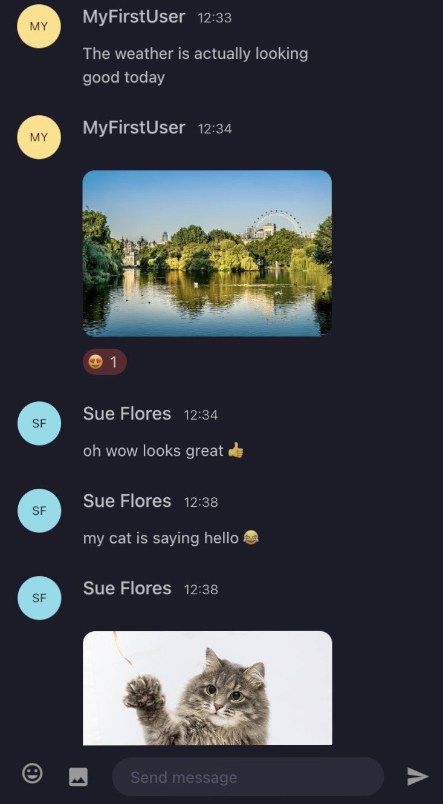

# bc-messenger

**_bc-messenger_ is a prototype of instant messaging application built with React and _PubNub_ as the backend. _PubNub_ documentation is available [here](https://www.pubnub.com/docs/sdks/javascript)**.

---

## Getting Started

To run this project, you will need to create a _.env_ file in the root directory of the app, copy and paste the contents of the _.env.example_ file and add the key values. Please, request the PubNub keys from the project owner or you can obtain your own API keys by following these [instructions](https://www.pubnub.com/how-to/admin-portal-create-keys/).

You will need to run `npm i` command in your terminal to install all required dependencies.

To run the app in the development mode, you can run either one of the following commands and then open [http://localhost:3000](http://localhost:3000) to view it in your browser:

- ### `npm start`
- ### `yarn start`

---

## Features

- ### Real-time messaging
  Enables instant communication with others and viewing of previously sent messages.
- ### Message reactions
  Allows to add reactions such as emojis to messages that are already published.
- ### Image upload
  Provides the ability to upload images of up to 5 MB in size. When a file is uploaded on a channel, it is stored using the key's storage service.
- ### Emojis/GIFs
  Enables selecting and including emojis and GIFs in text messages

---

## Testing

To launch the test runner in the interactive watch mode, run:

### `npm test`

---

## Building the app

To bundle and optimise the app for production, run:

### `npm run build`
